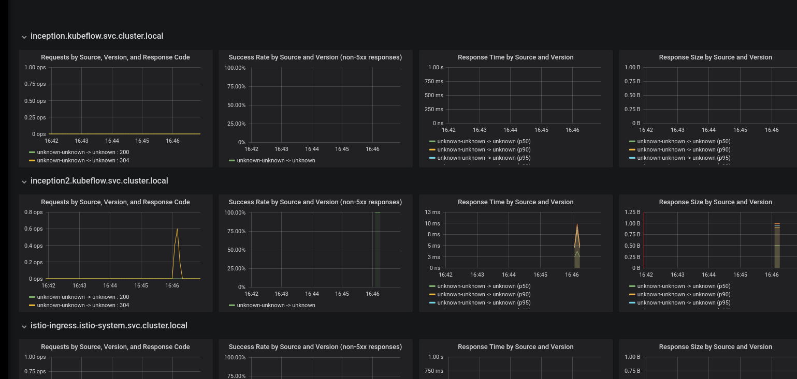

+++
title = "Istio Integration (for TF Serving)"
description = "Using Istio for TF Serving"
weight = 6
+++

[Istio](https://istio.io/) provides a lot of functionality that we want to have, such as metrics, auth and
quota, rollout and A/B testing.

## Install Istio
We assume Kubeflow is already deployed in the `kubeflow` namespace.

```
$ curl -L https://git.io/getLatestIstio | ISTIO_VERSION=1.3.3 sh -
$ export PATH=$HOME/istio-1.3.3/bin:$PATH
$ for i in $HOME/install/kubernetes/helm/istio-init/files/crd*yaml; do kubectl apply -f $i; done
```
Open `$HOME/install/kubernetes/istio-demo.yaml` and change *istio-ingressgateway* service from *LoadBalancer* to *NodePort*. Then run:

```
$ kubectl apply -f install/kubernetes/istio-demo.yaml
$ kubectl label namespace kubeflow istio-injection=enabled
```
The first and second command gets all the istio resources and adds the istioctl client to the path variable.
The second command installs Istio's CRDs.

The third command installs Istio's core components (without mTLS), with some customization:

1. sidecar injection configmap policy is changed from `enabled` to `disabled`

2. istio-ingressgateway is of type `NodePort` instead of `LoadBalancer`

<!-- The third command deploys some resources for Kubeflow. -->

The fourth command label the kubeflow namespace for sidecar injector.

See this [table](https://github.com/istio/istio/issues/6476#issuecomment-399219937) for sidecar injection
behavior. We want to have configmap disabled, and namespace enabled, so that injection happens if and only if
the pod has annotation.

## Kubeflow TF Serving with Istio

_This section has not yet been converted to kustomize, please refer to [kubeflow/manifests/issues/18](https://github.com/kubeflow/manifests/issues/18)._

After installing Istio, we can deploy the TF Serving component as in
[TensorFlow Serving](/docs/components/tfserving_new/) with
additional params:

```
ks param set ${MODEL_COMPONENT} injectIstio true
```

This will inject an istio sidecar in the TF serving deployment.

#### Routing with Istio vs Ambassador
With the ambassador annotation, a TF serving deployment can be accessed at `HOST/tfserving/models/MODEL_NAME`.
However, in order to use Istio's Gateway to do traffic split, we should use the path provided by
Istio routing: `HOST/istio/tfserving/models/MODEL_NAME`

### Metrics
The istio sidecar reports data to [Mixer](https://istio.io/docs/concepts/policy-and-control/mixer.html).
Execute the command:

```
kubectl -n istio-system port-forward $(kubectl -n istio-system get pod -l app=grafana -o jsonpath='{.items[0].metadata.name}') 3000:3000
```

Visit http://localhost:3000/dashboard/db/istio-mesh-dashboard in your web browser.
Send some requests to the TF serving service, then there should be some data (QPS, success rate, latency)
like this:



#### Define and view metrics
See istio [doc](https://istio.io/docs/tasks/telemetry/).

#### Expose Grafana dashboard behind ingress/IAP

Grafana needs to be [configured](http://docs.grafana.org/installation/behind_proxy/#examples-with-sub-path-ex-http-foo-bar-com-grafana)
to work properly behind a reverse proxy. We can override the default config using
[environment variable](http://docs.grafana.org/installation/configuration/#using-environment-variables).
So do `kubectl edit deploy -n istio-system grafana`, and add env vars

  ```
  - name: GF_SERVER_DOMAIN
    value: YOUR_HOST
  - name: GF_SERVER_ROOT_URL
    value: '%(protocol)s://%(domain)s:/grafana'
  ```

### Rolling out new model

A typical scenario is that we first deploy a model A. Then we develop another model B, and we want to deploy it
and gradually move traffic from A to B. This can be achieved using Istio's traffic routing.

1. Deploy the first model as described for
  [TensorFlow Serving](/docs/components/tfserving_new/).
  Then you will have the service (Model) and the deployment (Version).

2. Deploy another version of the model, v2. This time, no need to deploy the service part.

    ```
    MODEL_COMPONENT2=mnist-v2
    KF_ENV=default
    ks generate tf-serving-deployment-gcp ${MODEL_COMPONENT2}
    ks param set ${MODEL_COMPONENT2} modelName mnist  // modelName should be the SAME as  the previous one
    ks param set ${MODEL_COMPONENT2} versionName v2   // v2 !!
    ks param set ${MODEL_COMPONENT2} modelBasePath gs://kubeflow-examples-data/mnist
    ks param set ${MODEL_COMPONENT2} gcpCredentialSecretName user-gcp-sa
    ks param set ${MODEL_COMPONENT2} injectIstio true   // This is required

    ks apply ${KF_ENV} -c ${MODEL_COMPONENT2}
    ```

    The `KF_ENV` environment variable represents a conceptual deployment environment
    such as development, test, staging, or production, as defined by
    ksonnet. For this example, we use the `default` environment.
    You can read more about Kubeflow's use of ksonnet in the Kubeflow
    [ksonnet component guide](/docs/components/ksonnet/).

3. Update the traffic weight

   ```
   ks param set mnist-service trafficRule v1:90:v2:10   // This routes 90% to v1, and 10% to v2
   ks apply ${KF_ENV} -c mnist-service
   ```
