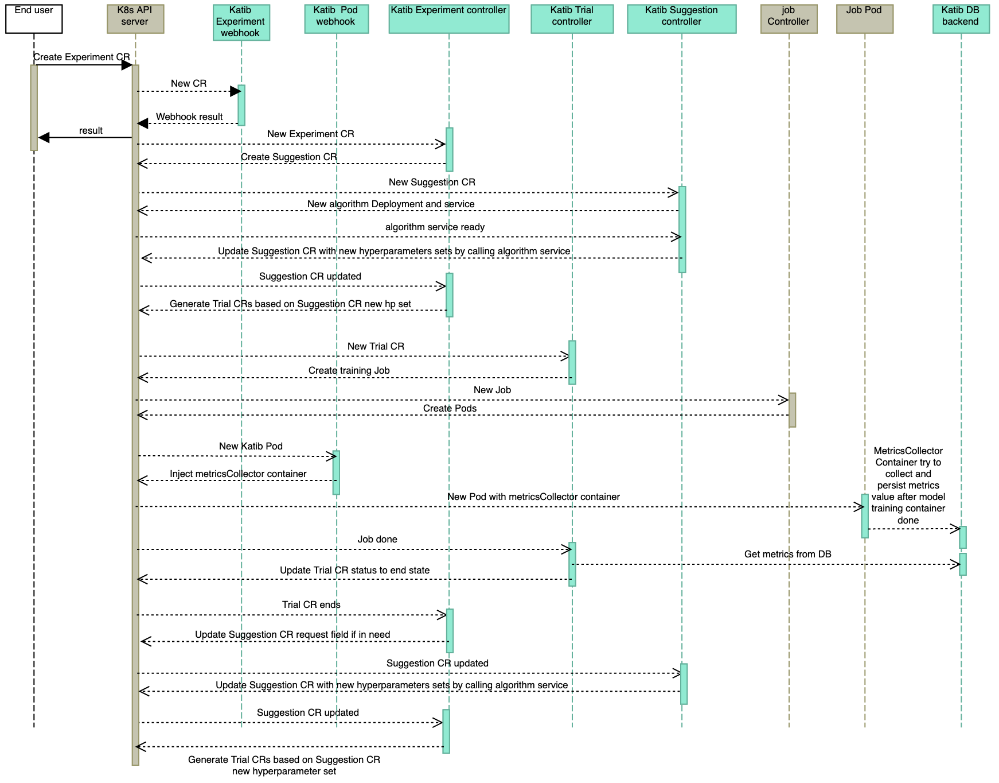

+++
title = "Katib Experiment CR"
description = "What happens after an `Experiment` CR is created"
weight = 10
+++

## Katib Experiment Lifecycle

When user creates an `Experiment` CR, Katib `Experiment` controller,
`Suggestion` controller and `Trial` controller is working together to achieve
hyperparameters tuning for user's Machine learning model. The Experiment
workflow looks as follows:

1. The `Experiment` CR is submitted to the Kubernetes API server. Katib
   `Experiment` mutating and validating webhook is called to set the default
   values for the `Experiment` CR and validate the CR separately.

1. The `Experiment` controller creates the `Suggestion` CR.

1. The `Suggestion` controller creates the algorithm deployment and service
   based on the new `Suggestion` CR.

1. When the `Suggestion` controller verifies that the algorithm service is
   ready, it calls the service to generate
   `spec.request - len(status.suggestions)` sets of hyperparameters and append
   them into `status.suggestions`.

1. The `Experiment` controller finds that `Suggestion` CR had been updated and
   generates each `Trial` for the each new hyperparameters set.

1. The `Trial` controller generates `Worker Job` based on the `runSpec`
   from the `Trial` CR with the new hyperparameters set.

1. The related job controller
   (Kubernetes batch Job, Kubeflow TFJob, Tekton Pipeline, etc.) generates
   Kubernetes Pods.

1. Katib Pod mutating webhook is called to inject the metrics collector sidecar
   container to the candidate Pods.

1. During the ML model container runs, the metrics collector container
   collects metrics from the injected pod and persists metrics to the Katib
   DB backend.

1. When the ML model training ends, the `Trial` controller updates status
   of the corresponding `Trial` CR.

1. When the `Trial` CR goes to end, the `Experiment` controller increases
   `request` field of the corresponding `Suggestion` CR if it is needed,
   then everything goes to `step 4` again.
   Of course, if the `Trial` CRs meet one of `end` condition
   (exceeds `maxTrialCount`, `maxFailedTrialCount` or `goal`),
   the `Experiment` controller takes everything done.