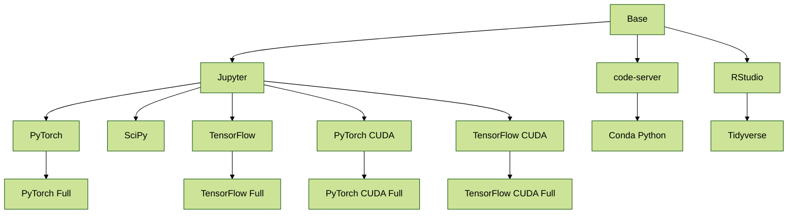

+++
title = "Container Images"
description = "About Container Images for Kubeflow Notebooks"
weight = 30
+++

Kubeflow Notebooks natively supports three types of notebooks, [JupyterLab](https://github.com/jupyterlab/jupyterlab), [RStudio](https://github.com/rstudio/rstudio), and [Visual Studio Code (code-server)](https://github.com/cdr/code-server), but any web-based IDE should work.
Notebook servers run as containers inside a Kubernetes Pod, which means the type of IDE (and which packages are installed) is determined by the Docker image you pick for your server.

## Official Images

Kubeflow provides a number of [example container images](https://github.com/kubeflow/kubeflow/tree/master/components/example-notebook-servers) to get you started with Kubeflow Notebooks.

This chart shows how the images are related to each other (note, the nodes are clickable links to the Dockerfiles):

### Base Images

These images provide a common starting point for Kubeflow Notebook containers.

Dockerfile | Container Registry | Notes
--- | --- | ---
[`./base`](https://github.com/kubeflow/kubeflow/tree/master/components/example-notebook-servers/base) | [`kubeflownotebookswg/base`](https://hub.docker.com/r/kubeflownotebookswg/base) | Common Base Image
[`./codeserver`](https://github.com/kubeflow/kubeflow/tree/master/components/example-notebook-servers/codeserver) | [`kubeflownotebookswg/codeserver`](https://hub.docker.com/r/kubeflownotebookswg/codeserver) | [code-server](https://github.com/coder/code-server) (Visual Studio Code)
[`./jupyter`](https://github.com/kubeflow/kubeflow/tree/master/components/example-notebook-servers/jupyter) | [`kubeflownotebookswg/jupyter`](https://hub.docker.com/r/kubeflownotebookswg/jupyter) | [JupyterLab](https://github.com/jupyterlab/jupyterlab)
[`./rstudio`](https://github.com/kubeflow/kubeflow/tree/master/components/example-notebook-servers/rstudio) | [`kubeflownotebookswg/rstudio`](https://hub.docker.com/r/kubeflownotebookswg/rstudio) | [RStudio](https://github.com/rstudio/rstudio)

### Kubeflow Images

These images extend the [base images](#base-images) with common packages used in the real world.

Dockerfile | Container Registry | Notes
--- | --- | ---
[`./codeserver-python`](https://github.com/kubeflow/kubeflow/tree/master/components/example-notebook-servers/codeserver-python) | [`kubeflownotebookswg/codeserver-python`](https://hub.docker.com/r/kubeflownotebookswg/codeserver-python) | code-server + Conda Python
[`./rstudio-tidyverse`](https://github.com/kubeflow/kubeflow/tree/master/components/example-notebook-servers/rstudio-tidyverse) | [`kubeflownotebookswg/rstudio-tidyverse`](https://hub.docker.com/r/kubeflownotebookswg/rstudio-tidyverse) | RStudio + [Tidyverse](https://www.tidyverse.org/)
[`./jupyter-pytorch`](https://github.com/kubeflow/kubeflow/tree/master/components/example-notebook-servers/jupyter-pytorch) | [`kubeflownotebookswg/jupyter-pytorch`](https://hub.docker.com/r/kubeflownotebookswg/jupyter-pytorch) | JupyterLab + PyTorch
[`./jupyter-pytorch-full`](https://github.com/kubeflow/kubeflow/tree/master/components/example-notebook-servers/jupyter-pytorch-full) | [`kubeflownotebookswg/jupyter-pytorch-full`](https://hub.docker.com/r/kubeflownotebookswg/jupyter-pytorch-full) | JupyterLab + PyTorch + Common Packages
[`./jupyter-pytorch-cuda`](https://github.com/kubeflow/kubeflow/tree/master/components/example-notebook-servers/jupyter-pytorch-cuda) | [`kubeflownotebookswg/jupyter-pytorch-cuda`](https://hub.docker.com/r/kubeflownotebookswg/jupyter-pytorch-cuda) | JupyterLab + PyTorch + CUDA
[`./jupyter-pytorch-cuda-full`](https://github.com/kubeflow/kubeflow/tree/master/components/example-notebook-servers/jupyter-pytorch-cuda-full) | [`kubeflownotebookswg/jupyter-pytorch-cuda-full`](https://hub.docker.com/r/kubeflownotebookswg/jupyter-pytorch-cuda-full) | JupyterLab + PyTorch + CUDA + Common Packages
[`./jupyter-scipy`](https://github.com/kubeflow/kubeflow/tree/master/components/example-notebook-servers/jupyter-scipy) | [`kubeflownotebookswg/jupyter-scipy`](https://hub.docker.com/r/kubeflownotebookswg/jupyter-scipy) | JupyterLab + Common Packages
[`./jupyter-tensorflow`](https://github.com/kubeflow/kubeflow/tree/master/components/example-notebook-servers/jupyter-tensorflow) | [`kubeflownotebookswg/jupyter-tensorflow`](https://hub.docker.com/r/kubeflownotebookswg/jupyter-tensorflow) | JupyterLab + TensorFlow
[`./jupyter-tensorflow-full`](https://github.com/kubeflow/kubeflow/tree/master/components/example-notebook-servers/jupyter-tensorflow-full) | [`kubeflownotebookswg/jupyter-tensorflow-full`](https://hub.docker.com/r/kubeflownotebookswg/jupyter-tensorflow-full) | JupyterLab + TensorFlow + Common Packages
[`./jupyter-tensorflow-cuda`](https://github.com/kubeflow/kubeflow/tree/master/components/example-notebook-servers/jupyter-tensorflow-cuda) | [`kubeflownotebookswg/jupyter-tensorflow-cuda`](https://hub.docker.com/r/kubeflownotebookswg/jupyter-tensorflow-cuda) | JupyterLab + TensorFlow + CUDA
[`./jupyter-tensorflow-cuda-full`](https://github.com/kubeflow/kubeflow/tree/master/components/example-notebook-servers/jupyter-tensorflow-cuda-full) | [`kubeflownotebookswg/jupyter-tensorflow-cuda-full`](https://hub.docker.com/r/kubeflownotebookswg/jupyter-tensorflow-cuda-full) | JupyterLab + TensorFlow + CUDA + Common Packages

## Package Installation

Packages installed by users __after spawning__ a Kubeflow Notebook will only last the lifetime of the pod (unless installed into a PVC-backed directory).

To ensure packages are preserved throughout Pod restarts users will need to either:

1. Build [custom images](#custom-images) that include them, or
2. Ensure they are installed in a PVC-backed directory

## Custom Images

You can build your own custom images to use with Kubeflow Notebooks.

The easiest way to ensure your custom image meets the [requirements](#image-requirements) is to extend one of our [base images](#base-images).

### Image Requirements

For a container image to work with Kubeflow Notebooks, it must:

- expose an HTTP interface on port `8888`:
  - kubeflow sets an environment variable `NB_PREFIX` at runtime with the URL path we expect the container be listening under
  - kubeflow uses IFrames, so ensure your application sets `Access-Control-Allow-Origin: *` in HTTP response headers
- run as a user called `jovyan`:
  - the home directory of `jovyan` should be `/home/jovyan`
  - the UID of `jovyan` should be `1000`
- start successfully with an empty PVC mounted at `/home/jovyan`:
  - kubeflow mounts a PVC at `/home/jovyan` to keep state across Pod restarts

### Install Python Packages

You may extend one of the images and install any `pip` or `conda` packages your Kubeflow Notebook users are likely to need.
As a guide, look at [`./jupyter-pytorch-full/Dockerfile`](https://github.com/kubeflow/kubeflow/tree/master/components/example-notebook-servers/jupyter-pytorch-full/Dockerfile) for a `pip install ...` example, and the [`./rstudio-tidyverse/Dockerfile`](https://github.com/kubeflow/kubeflow/tree/master/components/example-notebook-servers/rstudio-tidyverse/Dockerfile) for `conda install ...`.

A common cause of errors is users running `pip install --user ...`, causing the home-directory (which is backed by a PVC) to contain a different or incompatible version of a package contained in  `/opt/conda/...`

### Install Linux Packages

You may extend one of the images and install any `apt-get` packages your Kubeflow Notebook users are likely to need.
Ensure you swap to `root` in the Dockerfile before running `apt-get`, and swap back to `$NB_USER` after.

### Configure S6 Overlay

Some use-cases might require custom scripts to run during the startup of the Notebook Server container, or advanced users might want to add additional services that run inside the container (for example, an Apache or NGINX web server).
To make this easy, we use the [s6-overlay](https://github.com/just-containers/s6-overlay).

The [s6-overlay](https://github.com/just-containers/s6-overlay) differs from other init systems like [tini](https://github.com/krallin/tini).
While `tini` was created to handle a single process running in a container as PID 1, the `s6-overlay` is built to manage multiple processes and allows the creator of the image to determine which process failures should silently restart, and which should cause the container to exit.

#### Create Scripts

Scripts that need to run during the startup of the container can be placed in `/etc/cont-init.d/`, and are executed in ascending alphanumeric order.

An example of a startup script can be found in [`./rstudio/s6/cont-init.d/02-rstudio-env-fix`](https://github.com/kubeflow/kubeflow/tree/master/components/example-notebook-servers/rstudio/s6/cont-init.d/02-rstudio-env-fix).
This script uses the [with-contenv](https://github.com/just-containers/s6-overlay#container-environment) helper so that environment variables (passed to container) are available in the script.
The purpose of this script is to snapshot any `KUBERNETES_*` environment variables into the `Renviron.site` at pod startup, as without these variables `kubectl` does not work.

#### Create Services

Extra services to be monitored by `s6-overlay` should be placed in their own folder under `/etc/services.d/` containing a script called `run` and optionally a finishing script `finish`.

An example of a service can be found in the `run` script of [jupyter/s6/services.d/jupyterlab](jupyter/s6/services.d/jupyterlab) which is used to start JupyterLab itself.
For more information about the `run` and `finish` scripts, please see the [s6-overlay documentation](https://github.com/just-containers/s6-overlay#writing-a-service-script).

#### Run Services As Root

There may be cases when you need to run a service as root, to do this, you can change the Dockerfile to have `USER root` at the end, and then use `s6-setuidgid` to run the user-facing services as `$NB_USER`.

Our example images run `s6-overlay` as `$NB_USER` (not `root`), meaning any files or scripts related to `s6-overlay` must be owned by the `$NB_USER` user to successfully run.

## Next steps

- Use your container image by specifying it when spawning your notebook server.
  (See the [quickstart guide](/docs/components/notebooks/quickstart-guide/).)