## Overview

As organizations increasingly adopt Kubernetes for large-scale data processing, efficiently executing **Apache Spark** workloads on Kubernetes has become a critical need. The **Kubeflow Spark Operator** streamlines Spark job submission and management within Kubernetes, yet its capacity to handle high-concurrency workloads involving thousands of job submissions and tens of thousands of pods requires thorough validation. To assess the operator’s current performance, we developed benchmark scripts and conducted tests using Kubeflow Spark Operator. These tests are repeatable, enabling users to leverage this benchmarking toolkit to evaluate future releases as performance optimizations are introduced.

Benchmarking is essential to determine how effectively the Spark Operator performs under heavy load, particularly with thousands of concurrent job submissions and constrained resource allocations. Key objectives include:

* Identifying bottlenecks in the controller’s processing of SparkApplication CRs.
* Optimizing resource allocation for the Spark Operator controller pod.
* Assessing whether a single operator instance is sufficient or if multiple instances are required for enhanced performance.
* Pinpointing bottlenecks in Kubernetes job scheduling, API responsiveness, and resource management.

This guide offers a detailed framework for benchmarking the Kubeflow Spark Operator, adaptable to any Kubernetes cluster. While the configurations and results presented here are based on Amazon EKS, the methodology is flexible and can be applied to other cloud providers or on-premises Kubernetes environments.


These benchmarks focus on **evaluating the Spark Operator’s performance**, not the Spark jobs themselves. To isolate the operator’s ability to manage high job submission rates and pod launches, minimal resources are allocated to driver and executor pods. This approach reduces the number of nodes needed, allowing a clear assessment of the operator’s efficiency in scheduling and launching jobs under high concurrency.



## How the Spark Operator Works
The Kubeflow Spark Operator extends Kubernetes by introducing the `SparkApplication` custom resource definition (CRD), which defines Spark job configurations such as driver and executor pod specifications, dependencies, and runtime arguments. A controller, deployed as a pod and managed via Helm, oversees these CRDs through a reconciliation loop that includes submitting jobs by translating SparkApplication objects into Kubernetes pods via the API, managing their lifecycle by tracking states (e.g., **Pending**, **Running**, **Completed**, **Failed**) and updating statuses, scheduling resources in coordination with the Kubernetes scheduler (optionally using webhooks for validation), and cleaning up by terminating completed or failed jobs unless explicitly disabled. 

Built on the **controller-runtime** library, the operator processes submissions through a single work queue per instance.  Each controller instance operates independently with its own queue, and performance hinges on CPU availability, memory for JVM processes spawned per submission, and Kubernetes API responsiveness. 

## Available Tuning Parameters in Helm Values
Spark Operator [Helm chart](https://github.com/kubeflow/spark-operator/tree/master/charts/spark-operator-chart) provides several parameters to tune the Spark Operator’s performance:

* **controller.workers**: Sets the number of reconciler threads (`default: 10`). Increasing this (e.g., to 20 or 30) enhances concurrency, potentially boosting throughput if CPU resources allow, though API latency may limit gains.
* **workqueueRateLimiter**:
    * **bucketQPS** (default: `50`): This limits the average rate (items per second) at which the queue processes jobs. Increasing it might seem like it would speed things up, but if the operator’s controller pod is already maxing out its CPU or waiting on the Kubernetes API server, the queue won’t process faster.
    * **bucketSize** (default: `500`): This sets the maximum number of jobs that can be queued. Raising it allows more jobs to pile up during bursts, but if the processing rate doesn’t increase, those extra jobs just wait longer.
    * **maxDelay.enable** and **maxDelay.duration** (default: `true`, 6h): Manages overflow behavior. Reducing duration (e.g., to 1h) may expedite requeuing but risks event loss if the queue remains full.
* **webhook.enable**: Toggles webhook usage (default: `true`). Disabling this (`false`) reduces latency (~60s per job) but requires leveraging Spark Pod Templates feature.
* **batchScheduler.enable**: Enables a batch scheduler like **Volcano** or **Yunikorn** (default: `false`). Setting to true optimizes pod scheduling for large-scale workloads.
* **Controller resources**: Defines CPU/memory requests and limits for the controller pod (default: `unset`). Allocating more resources (e.g., 64 vCPUs, 20Gi) supports higher concurrency.

## Infrastructure Setup

### 1. Cluster Configuration

* **Kubernetes Cluster**: Tested on **Amazon EKS 1.31** (eks.19), adaptable to any **Kubernetes** environment.
* **Networking**:
    * Two Subnets: Deployed to `100.64.128.0/171` and `100.64.0.0/17`  subnets (32766 IP addresses each) spread across two availability zones in a VPC with two CIDRs attached. Spark Jobs targeted to run one a single AZ.
* **Node Configuration**:
    * **Dedicated Node Group for Spark Pods**: Optimized for pod bin-packing efficiency to minimize costs, using `200` `m6a.4xlarge nodes` (16 vCPUs, 64 GB RAM each). Default pod capacity is **110** per node, increased to **220** via kubelet settings (`maxPods`) to handle more Spark pods, each consuming one IP address.
    * **Dedicated Node Group for Spark Operator**: Ensures that the Spark Operator runs in isolation on a compute intensive c5.9xlarge instance, preventing interference from other workloads. This approach follows best practices for system-critical components, reducing the risk of eviction or resource contention.
    * **Spark Operator Controller and Webhook Pod Resources**: Requested `33 vCPUs` and `50 Gi` memory for the controller pod, `1vCPU` and `10Gi` memory for webook pod, tailored for benchmarks tests.
    * **Dedicated Node Group for Prometheus**: Used to capture and monitor metrics with the Kube Prometheus Stack, which includes **Prometheus** and **Grafana** for visualization. At scale, Prometheus can consume significant CPU and memory, so running it on dedicated node ensures it doesn’t compete with Spark Pods. It’s common to dedicate a node or node pool solely to monitoring components (Prometheus, Grafana, etc.) using node selectors or taints.
    
{}
**Provisioning 200 nodes can be costly (e.g., ~$0.6912 per node on EKS). Users should assess expenses before replication.**
{}

### 2. Workload Configuration
* **Software Versions**:
    * Spark Operator Version: Latest stable release (e.g., `v2.1.0`).
    * Spark Version: `Apache Spark 3.5.3` (compatible with the operator).
* **Job Type**: Spark job that calculates Pi and includes a sleep interval of 1 hour to simulate a fixed runtime.
* **Concurrency**: Jobs are submitted concurrently to simulate high-concurrency workloads. Key details include:
    * **Total Applications**: `6000` Spark applications.
    * **Applications per Virtual User**: `2000` applications per user, with three virtual users submitting jobs using **[Locust](https://locust.io/)** load test tool.
    * **Submission Rate**: Jobs are submitted at a rate of `1000` applications per minute to the Kubernetes cluster.
    * **Submission Window**: All `6000` jobs are submitted within a 6-minute period, leaving the Spark Operator to process and manage the workload over time.
    * **Total Pods**: Each Spark job consists of `1` driver pod and `5` executor pods, totaling 6 pods, resulting in `36000` pods across `6000` applications, supported by a cluster provisioned with `200` nodes to ensure sufficient resources for execution.

### 3. Metrics to Measure

To effectively evaluate the performance of the Kubeflow Spark Operator under high-concurrency workloads, we have developed a custom Grafana dashboard as part of this benchmark. This dashboard is open-source and freely available, allowing you to monitor both Spark Operator and Kubernetes metrics in your own environment. Below, we outline the key metrics tracked by the dashboard, categorized into three main areas: **Spark Operator Pod Metrics**, **Spark Application Metrics**, and **Kubernetes Metrics**. These metrics provide a comprehensive view of resource usage, job processing efficiency, and cluster health.

#### Spark Operator Pod Metrics

* **Max CPU Usage**: Tracks the highest CPU consumption of the controller pod, helping you determine if it becomes CPU-bound under heavy load.
* **Max Memory Usage**: Monitors peak memory usage to ensure the pod has adequate memory for job processing.
* **Network Transmit Bytes**: Tracks the volume of data sent by the controller pod, useful for spotting network bottlenecks.
* **Network Receive Bytes**: Monitors incoming data to assess if network latency affects performance.
* **Work Queue Depth**: Measures the number of pending SparkApplication submissions in the queue, indicating whether the operator can keep pace with incoming jobs. e.g., `workqueue_depth{container="spark-operator-controller"}`
* **Work Queue Total Adds**: Counts the total number of jobs added to the work queue over time, reflecting the workload’s intensity.
* **Work Queue Duration (Secs)**: Measures how long jobs wait in the queue before processing, highlighting potential delays.
* **Work Duration (Secs)**: Tracks the time taken to process each job, showing the efficiency of the operator’s reconciliation loop.
* **Work Queue Total Retries**: Counts job retries, indicating issues with job submission or pod creation.
* **Longest Running Controller Thread (Secs)**: Measures the maximum duration of a single reconciler thread, helping detect slow or stuck operations.
* **Unfinished Work**: Tracks jobs that remain in progress, ensuring all submissions are completed eventually.

#### Spark Application Metrics

* **Start Latency Percentiles (Secs)**: Measures the time from job submission to execution start, with percentiles (e.g., `p50`, `p90`, `p99`) to show latency distribution.
* **Spark Job Count**: Tracks the total number of submitted, running, and completed Spark jobs, offering a snapshot of workload progress.
* **Job Submission Rate (Jobs per min)**: Monitors the rate of job submissions, ensuring it matches the intended concurrency level.
* **Job Success Rate**: Calculates the percentage of jobs that complete successfully, helping identify failures or errors.
* **Job Failure Trend**: Tracks job failures over time, allowing you to spot periods of instability or resource contention.

#### Kubernetes Metrics

* **API Server Latency (p90)**: Measures the 90th percentile latency for API server requests, indicating potential delays in API responsiveness.
* **API Server Request Duration (Secs)**: Tracks the total duration of API requests, helping pinpoint slow operations.
* **Admission Webhook Admission Duration (Secs)**: Monitors the time taken by admission webhooks, which can slow pod creation if enabled.
* **Etcd Latency (p99)**: Measures the 99th percentile latency for etcd operations, crucial for understanding database performance under load.
* **API Server Total DB Size**: Tracks the size of the etcd database, ensuring it remains manageable and doesn’t degrade performance.
* **Spark Application Object Count**: Counts the number of SparkApplication custom resources (CRs) in the cluster, reflecting workload scale.
* **Node Object Count**: Monitors the number of nodes, verifying that the cluster scales appropriately for the workload.
* **Pod Object Count**: Tracks the total number of pods, ensuring the cluster can support the expected volume (e.g., up to 36,000 pods).

## How to run Benchmark test

### Test Setup

**Benchmarking Tool**: Locust is used to simulate concurrent job submissions and measure performance metrics. The Locust script dynamically generates and submits SparkApplication YAML files to the Kubernetes cluster.

* **Dynamic Job Naming**: Each job is assigned a unique name using `uuid.uuid4()`.
* **Rate Limiting**: Jobs are submitted at a controlled rate (e.g., 1 job per sec).
* **Job Status Monitoring**: The script monitors the status of submitted jobs to ensure they are running as expected.
* **Cleanup**: Jobs are deleted after the test unless the  `--no-delete-jobs` flag is set.

**Locust Script Configuration**: The following parameters are available in the Locust script.

* **Users (-u)**: Number of concurrent virtual users for Locust script
* **Jobs Per Minute (--jobs-per-min)**: Controls the rate of job submissions.
* **Jobs Limit (--job-limit-per-user)**: Maximum number of jobs to submit for each user.
* **Namespaces (--spark-namespaces)**: Jobs submitted across specified namespaces.
* **Spark Job Template (--spark_job_template)**: Path to the SparkApplication YAML template.
* **Delete Jobs (--no-delete-jobs)**: If set, jobs are not deleted after the test (useful for debugging).

The benchmarking process uses Locust, which creates user processes that execute tasks based on configurations in the `locustfile.py` file. This allows us to generate and submit SparkApplication CRDs at a controlled rate, enabling us to measure performance at scale.

#### Installation

To begin, install Locust and its dependencies in a virtual environment:

```sh
python3.12 -m venv venv
source venv/bin/activate
pip install -r requirements.txt
```

#### Running Locust

For this benchmark, we’ve pre-created three Spark job namespaces `spark-team-a`, `spark-team-b`, and `spark-team-c` to distribute the workload evenly across them. These namespaces are configured in the Spark Operator’s Helm values under `controller.spark.jobNamespaces`, ensuring the operator watches only these namespaces for job submissions. The following command runs Locust in headless mode, submitting `6000` jobs at a rate of `1000` jobs per minute across these namespaces:

```sh
locust --headless --only-summary -u 3 -r 1 \
--job-limit 2000 \
--jobs-per-min 1000 \
--spark-namespaces spark-team-a,spark-team-b,spark-team-c
```

## Benchmark results
To assess the performance of the Kubeflow Spark Operator under high-concurrency workloads, we conducted two key tests: one with webhooks enabled and another with webhooks disabled. These tests involved submitting `6,000` Spark applications each with 1 driver and 5 executor pods, totaling 36,000 pods at a rate of 1,000 jobs per minute across three namespaces. Below, we detail the test configurations, observations, and key findings, presented in a clear and structured manner to highlight the operator’s behavior and limitations.

### Test1:  6000 Spark Applications (With Webhook Enabled)

#### Test Configuration:

* **Spark Operator Controller Pod**:
    * **Instance Type**: `c5.9xlarge`
    * **Resources**: `36` vCPUs, `72` GB memory.
    * **Deployment**: Helm chart deployed with default values.
    * **Controller Threads**: `20` threads.
    * The operator was deployed with default helm configuration except for `metrics-job-start-latency-buckets` because the default maximum bucket size of 500 was too small to meaningfully measure job start time. Checkout the [PR](https://github.com/kubeflow/spark-operator/pull/2450)
* **Spark Application Pods**:
    * **Number of Nodes**: `200`
    * **Instance Type**: `m6a.4xlarge`
    * **Resources**: `16` vCPUs, `64` GB memory per node.
    * **Driver and Executors**: 1 Driver and 5 executor pods per application.
    * **Job Behavior**: Executors primarily sleep to simulate minimal resource usage.
* **Workload**:
    * **Job Type**: Simple Spark jobs with a fixed runtime (sleeping for most of the duration).
    * **Total Jobs**: 6000 jobs across three namespaces (`spark-team-a`, `spark-team-b`, `spark-team-c`) at a rate of `1000 job` submissions per minute:
    * This test is limited by CPU constraints and ensures consistent load across multiple namespaces to simulate real-world usage scenarios.

#### Observations from Spark Operator Scale Test

* **CPU Utilization**:
  * The Spark Operator controller pod is **CPU-bound**, utilizing all `36 cores` during peak processing. 
  * CPU constraints limit job processing speed, making compute power a key factor for scalability.
  * Spark Operator's throughput indicated by the `spark_application_submit_count metric`, is soley influenced by CPU single core speed, available number of cores, and configured number goroutines(`20`).
  * Increasing goroutines from `10` to `20` on a `36 core` machine improved the job submission rate from `~130-140` to `~140-155` jobs per minute (`~7-11%` gain), but showed diminishing returns likely due to Spark Operator queue processing bottlenecks.
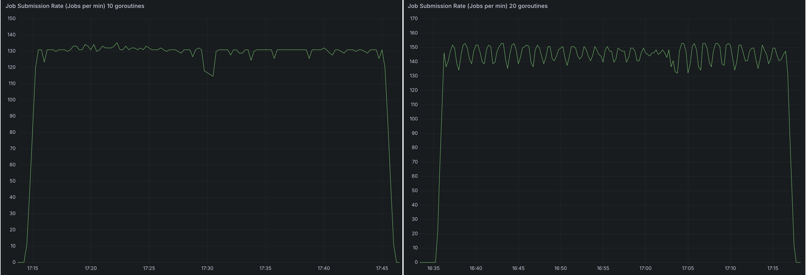

    

  - The number of applications submitted to the cluster does not affect the processing speed. There was no difference between `2000` apps and `6000` apps.
  - Memory footprint does not change between the number of apps submitted. However, with it does increase with the number of goroutine.
  - Memory consumption remains stable, regardless of the number of applications processed.
  - This indicates that memory is not a bottleneck, and increasing RAM would not improve performance.
  
* **Job Processing Rate**:
    * The Spark Operator processes applications at `~130` apps per minute.
    * The processing rate is capped by CPU limitations, preventing further scaling without additional compute resources.
    * Because the operator can only process `130` - `150` applications per minute, later Spark jobs took `~1` hour for their driver pods to spawn.

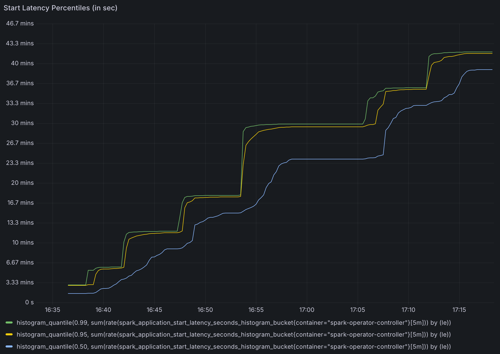

* **Time to Process Jobs**:
    * `~15` minutes to process `2,000` applications.
    * `~30` minutes to process `4,000` applications.
    * These numbers align with the observed 130 apps per minute processing rate.
    * Because Spark operator was busy processing new applications, updates to status of submitted spark application were slow. Some applications took `~30` minutes for their status to be updated.
* **Work Queue Duration Metric Reliability**:
    * The default work queue duration metric becomes unreliable once it exceeds `16` minutes. 
        * The default configuration for the `metrics-job-start-latency-buckets` option for the spark operator has a max bucket of `300s`, we increased the buckets for our testing but the metric did not record latency beyond 300s. 
    * Under high concurrency, this metric fails to provide accurate insights into queue processing times.
* **API Server Performance Impact**:
    * Kubernetes API request duration increases significantly under high workload conditions.
    * Consistent significant delay in `LIST` calls. This is not caused by the Operator, it's caused by Spark listing pods in its own namespace to find executor pods.
    * This is caused by Spark querying executor pods frequently, not a limitation of the Spark Operator itself.
    * The increased API server load affects job submission latency and monitoring performance across the cluster.

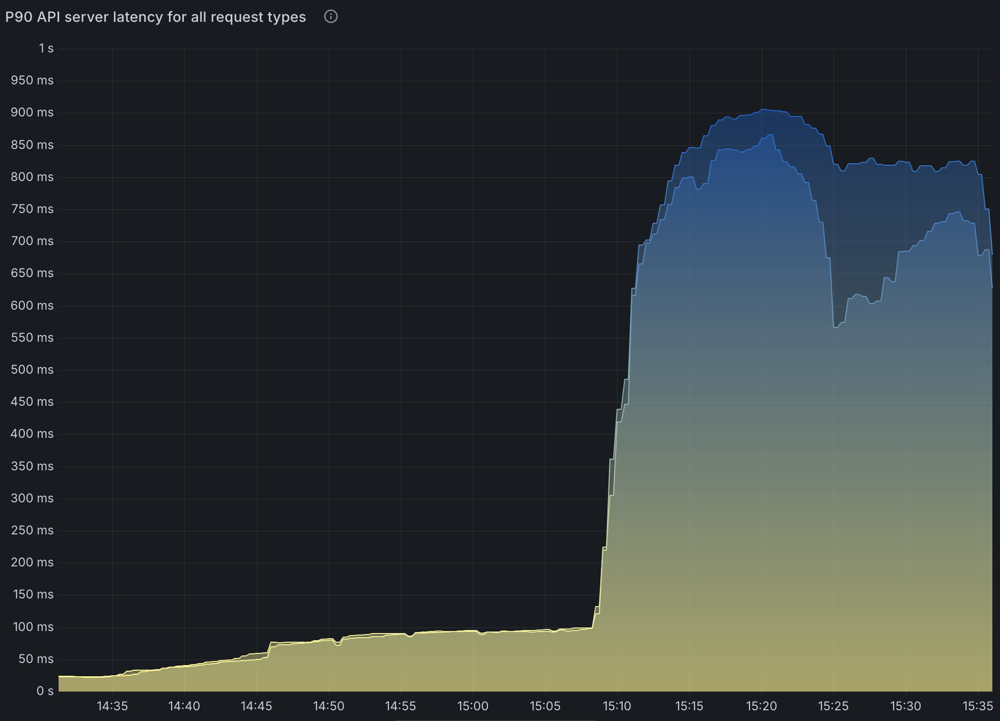

Note that setting `spark.kubernetes.executor.enablePollingWithResourceVersion: "true"` in SparkApplication config greatly alleviates this issue.

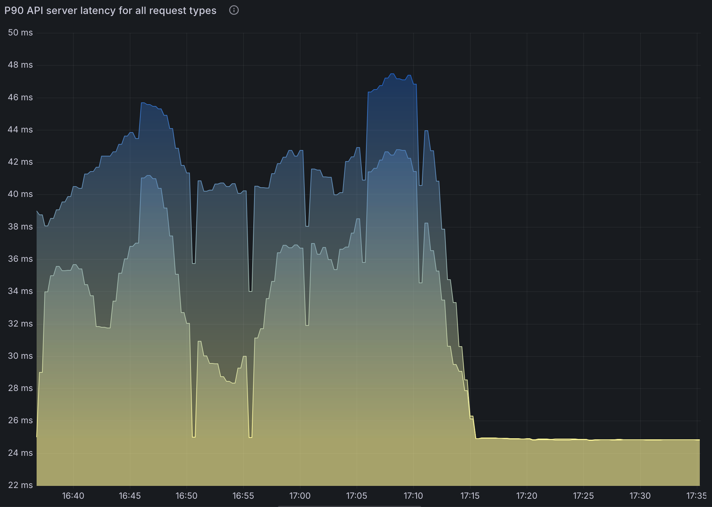

However, this means the API server could return any version of pods especially in HA configurations. This could lead to an inconsistent state that Spark cannot recover from.

* `6000 Spark Jobs`. Spread across three namespaces with 2000 applications in each namespace.
* Controller workers set to `10`
* `130 apps` processed per minute.
* `~25 cores` in use.
* Significantly increased API latency.

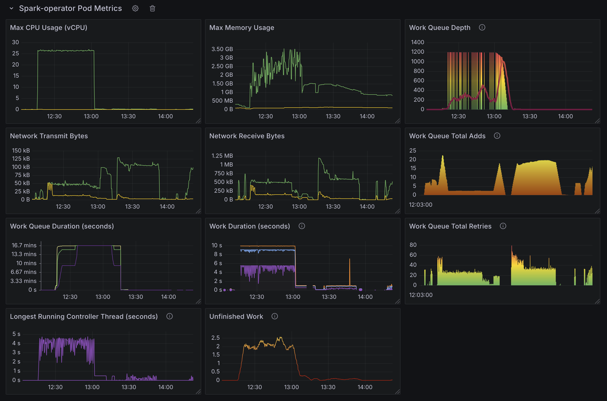 
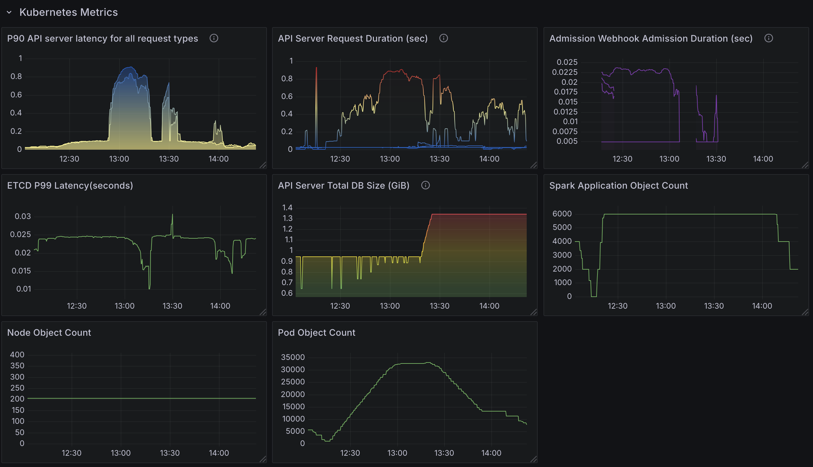 
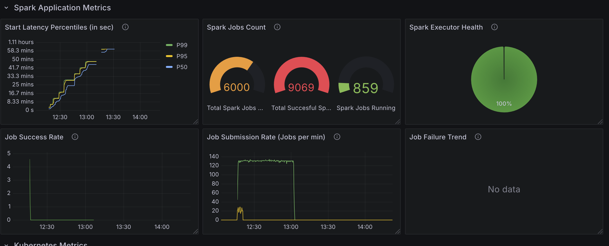

#### Test2:  6000 Spark Applications with 20 Controller Workers
- 6000 Spark Jobs. Spread across three namespaces with 2000 applications in each namespace.

**Changes:**
- Increased available configured number of goroutine to `20` from `10` (default).

**Observation:**
- `140` - `150` apps processed per minute.
- `35` cores in use. 
- Otherwise results are similar to the default configuration results.

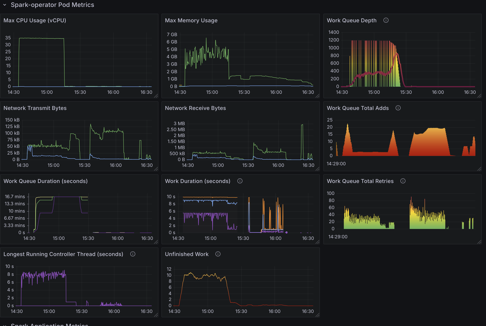 
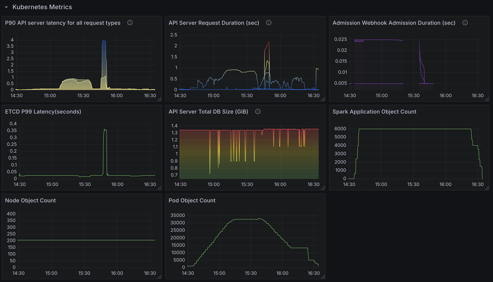 
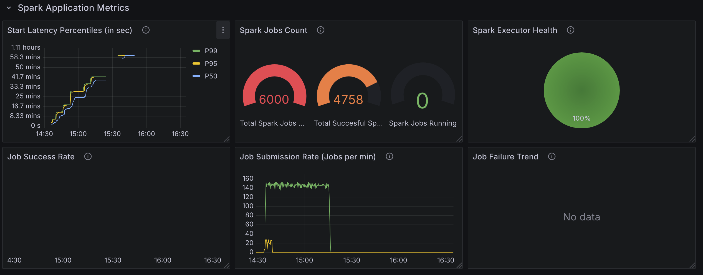

#### Test3:  6000 Spark Applications with 20 Controller Workers and resource version set to 0.

**Changes:**
* Increased available configured number of goroutine to `20` from `10` (default).
* Set `spark.kubernetes.executor.enablePollingWithResourceVersion: "true"` in SparkApplication config.
* `6000` Spark Jobs. Spread across three namespaces with `2000` applications in each namespace.

**Observation:**
* Increase in API latency is virtually gone as expected.
* `140` - `150` apps processed per minute.
* `35 cores` in use. 

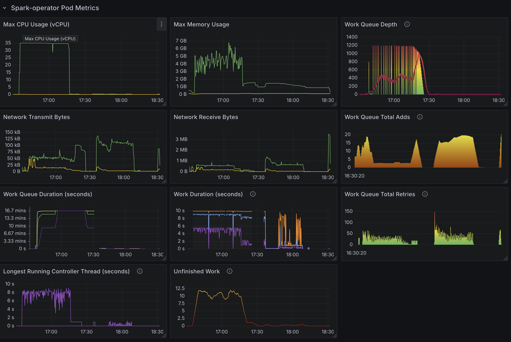 
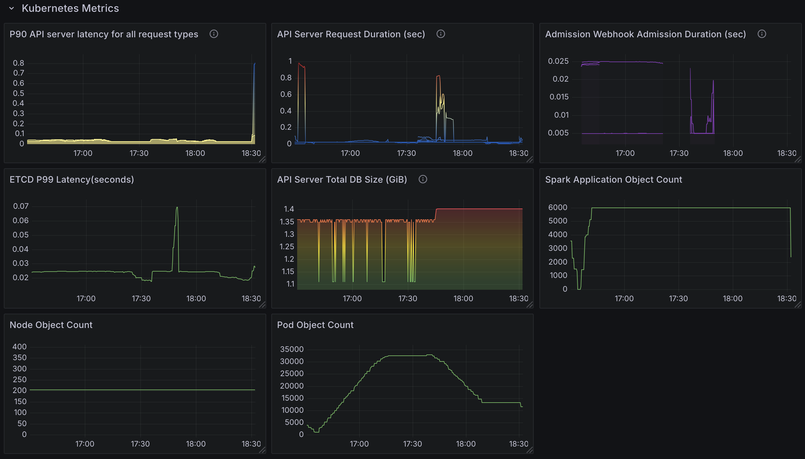 
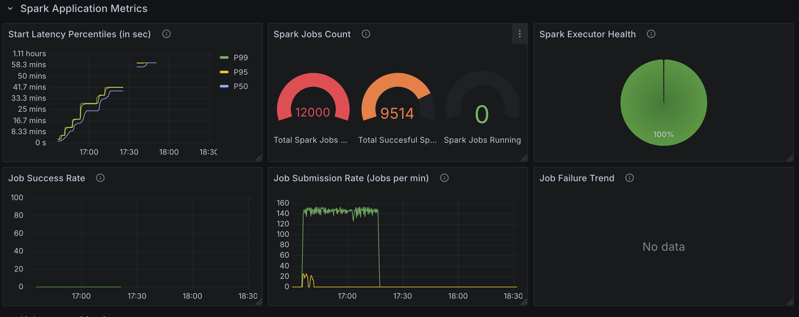

#### Test4: 6,000 Spark Applications (With Webhook Disabled)

**Test Configuration:**
* Identical to Test 1, except webhooks were disabled to evaluate their impact on performance.

**Observation:**
* Disabling webhooks reduced job start latency by approximately 60 seconds per job, enhancing overall throughput.

## Key Takeaways

### CPU Constraints in the Spark Operator
* The Spark Operator’s controller pod is heavily CPU-bound. Increasing the number of controller workers (goroutines) from `10` to `20` improved the processing rate from `~130` to `~150` applications per minute, but CPU usage peaked, indicating that CPU resources are the limiting factor.
* Memory usage remained stable, suggesting that memory is not a bottleneck for the operator.

### Kubernetes API Server Latency
* High API server latency, peaking at ~600 ms under heavy load (e.g., `36000` pod creations), significantly impacted job submission and status updates. This latency was primarily caused by Spark’s frequent queries for executor pods, not by the operator itself.
* Enabling `spark.kubernetes.executor.enablePollingWithResourceVersion: "true"` reduced API latency but introduced the risk of inconsistent pod states in high-availability (HA) setups, potentially leading to job failures.

### Webhook Overhead
* Enabling webhooks added `~6`0 seconds of latency per job, significantly reducing throughput. Disabling webhooks improved performance by leveraging Pod Templates but sacrificed validation and mutation features.

### Namespace Management Issues
* Running 6000 SparkApplications in a single namespace caused pod failures with the error: `exec /opt/entrypoint.sh: argument list too long`
* This occurred because each SparkApplication creates a service object, and the accumulation of services overwhelmed environment variables storing host and port details. Service objects persist after job completion unless SparkApplication objects are manually removed. See this article for more information.

### Processing Delays
* The operator processed `~130–150` applications per minute, leading to significant delays for large workloads (e.g., `~1` hour for driver pods to spawn in a `6,000` job submission). Status updates for some jobs lagged by up to `30 minutes` as the operator prioritized new submissions over updates.

## Recommendations

To optimize the Kubeflow Spark Operator for high-concurrency workloads, consider the following strategies:

### Deploy Multiple Spark Operator Instances

* **Why**: A single operator instance struggles with large workloads due to CPU and processing limits. Distributing the load across multiple instances leverages parallelism to reduce processing time.
* **How**:
    * Deploy a separate Spark Operator instance per namespace (e.g., `spark-team-a`, `spark-team-b`, `spark-team-c`) using Helm.
    * Configure each instance with `spark.jobNamespaces` set to its respective namespaces.
* **Benefit**: With three instances, each handling `2,000 jobs` from a `6,000` job submission, processing could complete in `~15` minutes (assuming even distribution), compared to `~1` hour with a single instance.
* **Considerations**:
    * Assign each instance a unique service account with namespace-scoped RBAC rules for isolation.
    * The Helm chart defaults to cluster-wide permissions, so custom configurations may be required.

### Disable Webhooks (with Caution)

* **Why**: Webhooks add `~60` seconds of latency per job, severely impacting throughput under high concurrency.
* **How**: Set `webhook.enable` to false in the Helm chart.
* **Benefit**: Eliminating this overhead accelerates job starts, as demonstrated in benchmark tests.
* **Considerations**:
    * Use Pod Templates for volume configuration, node selectors, and taints to replace webhook functionality.

### Increase the Number of Workers

* **Why**: More controller workers (goroutines) allow the operator to process jobs concurrently, boosting throughput if CPU resources are available.
* **How**: Increase controller.workers from `10` to `20` or `30` via the Helm chart. Choose compute intensive nodes for running Spark Operator (e.g., `c5.9xlarge` used in this test)
* **Benefit**: Tests showed a processing rate increase from `~130` to `~150` applications per minute with `20` workers. With `36 vCPUs` available, each worker could use `~1.8 vCPUs` at `20` workers, potentially scaling further.
* **Considerations**:
    * Monitor CPU usage (e.g., via Prometheus with `prometheus.metrics.enable`) to avoid saturation.
    * Effectiveness may be limited if API latency, not CPU, is the primary bottleneck.

### Enable a Batch Scheduler

* **Why**: These benchmarks didn’t cover the usage of Batch schedulers but `Volcano` or `Yunikorn` custom batch schedulers optimize resource allocation, reducing pod creation times for large-scale jobs.
* **How**:
    * Set batchScheduler.enable to true in the Helm chart.
    * Specify a scheduler (e.g., Volcano or Yunikorn) and install it in the cluster
* **Benefit**: Enhanced scheduling efficiency improves performance under high concurrency.

### Optimize Kubernetes Cluster Performance

* **Why**: High API server latency under load (e.g., `36,000` pod creations across `200 nodes`) hampers job processing. Existing node capacity (`m6a.4xlarge`, `16 vCPUs`, `64GB` RAM, up to `220` pods per node) is sufficient, but API server autoscaling and scheduler efficiency requires attention.
* **How**:
    * Scale API server replicas or allocate more resources (API server scaling is automatically handled by many cloud providers, including Amazon EKS).

### Manage Namespace Usage

* **Why**: Excessive SparkApplications in one namespace (e.g., `6,000`) cause pod failures due to environment variable overflow from persistent service objects.
* **How**:
    * Distribute Spark jobs across multiple namespaces (e.g., `spark-team-a`, `spark-team-b`, `spark-team-c`).
    * Set a `timeToLiveSeconds` duration for SparkApplication objects or deploy a custom garbage collection (GC) service to remove completed applications and their services.
* **Benefit**: Prevents failures and ensures reliable operation under high job volumes.
* **Considerations**: Service objects aren’t automatically deleted upon job completion, so proactive cleanup is essential.

### Monitor and Adjust

* **Why**: Continuous monitoring identifies bottlenecks and validates optimizations.
* **How**: Use the provided Grafana dashboard (enabled via Helm) to track metrics like work queue depth, CPU usage, API latency, and processing rates.
* **Benefit**: Data-driven tuning ensures the operator scales efficiently for large workloads.
* **Considerations**: Focus on CPU saturation and API responsiveness to guide adjustments.
