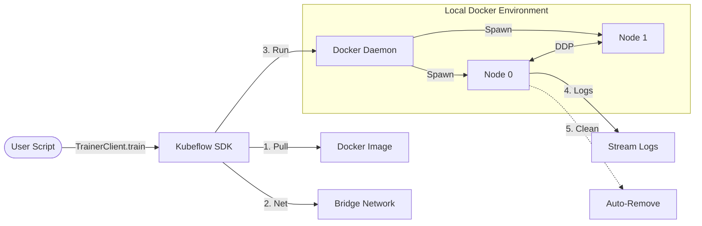

+++
title = "Docker Backend"
description = "How to run TrainJobs with Docker containers"
weight = 20
+++

## Overview

The Container Backend with Docker enables you to run distributed TrainJobs in isolated Docker containers on your local machine. This backend provides:

- **Full Container Isolation**: Each TrainJob runs in its own Docker container with isolated filesystem, network, and resources
- **Multi-Node Support**: Run distributed training across multiple containers with automatic networking
- **Reproducibility**: TrainJob runs in consistent containerized environments
- **Flexible Configuration**: Customize image pulling policies, resource allocation, and container settings

The Docker backend uses the adapter pattern to provide a unified interface, making it easy to switch between Docker and Podman without code changes.

## Architecture

The Container Backend with Docker uses a local orchestration layer to manage TrainJobs within Docker containers. This ensures environment parity between your local machine and production Kubernetes clusters.



## Prerequisites

### Required Software

- **Docker**: Install Docker Desktop (macOS/Windows) or Docker Engine (Linux)
  - macOS/Windows: Download from [docker.com](https://www.docker.com/products/docker-desktop)
  - Linux: Follow [Docker Engine installation guide](https://docs.docker.com/engine/install/)
- **Python 3.9+**
- **Kubeflow SDK**: Install with Docker support:
  ```bash
  pip install "kubeflow[docker]"
  ```

### Verify Installation

```bash
# Check Docker is running
docker version

# Test Docker daemon connectivity
docker ps

```

## Basic Example

Here's a simple example using the Docker Container Backend:

```python
from kubeflow.trainer import CustomTrainer, TrainerClient, ContainerBackendConfig

def train_model():
    """Simple training function."""
    import torch
    import os

    rank = int(os.environ.get('RANK', '0'))
    world_size = int(os.environ.get('WORLD_SIZE', '1'))

    print(f"Training on rank {rank}/{world_size}")

    # Your training code
    model = torch.nn.Linear(10, 1)
    optimizer = torch.optim.SGD(model.parameters(), lr=0.01)

    for epoch in range(5):
        loss = torch.nn.functional.mse_loss(
            model(torch.randn(32, 10)),
            torch.randn(32, 1)
        )
        optimizer.zero_grad()
        loss.backward()
        optimizer.step()

        print(f"[Rank {rank}] Epoch {epoch + 1}/5, Loss: {loss.item():.4f}")

    print(f"[Rank {rank}] Training completed!")

# Configure the Docker backend
backend_config = ContainerBackendConfig(
    container_runtime="docker",  # Explicitly use Docker
    pull_policy="IfNotPresent",  # Pull image if not cached locally
    auto_remove=True             # Clean up containers after completion
)

# Create the client
client = TrainerClient(backend_config=backend_config)

# Create a trainer with multi-node support
trainer = CustomTrainer(
    func=train_model,
    num_nodes=2  # Run distributed training across 2 containers
)

# Start the TrainJob
job_name = client.train(trainer=trainer)
print(f"TrainJob started: {job_name}")

# Wait for completion
job = client.wait_for_job_status(
    job_name,
)

print(f"Job completed with status: {job.status}")
```

## Configuration Options

### ContainerBackendConfig

| Parameter | Type | Default | Description |
|-----------|------|---------|-------------|
| `container_runtime` | `str \| None` | `None` | Force specific runtime: `"docker"`, `"podman"`, or `None` (auto-detect). Use `"docker"` to ensure Docker is used. |
| `pull_policy` | `str` | `"IfNotPresent"` | Image pull policy: `"IfNotPresent"` (pull if missing), `"Always"` (always pull), `"Never"` (use cached only). |
| `auto_remove` | `bool` | `True` | Automatically remove containers and networks after job completion or deletion. Set to `False` for debugging. |
| `container_host` | `str \| None` | `None` | Override Docker daemon connection URL (e.g., `"unix:///var/run/docker.sock"`, `"tcp://192.168.1.100:2375"`). |
| `runtime_source` | `TrainingRuntimeSource` | GitHub sources | Configuration for training runtime sources. See "Custom Runtime Sources" section below. |

### Configuration Examples

#### Basic Configuration

```python
backend_config = ContainerBackendConfig(
    container_runtime="docker",
)
```

#### Always Pull Latest Image

```python
backend_config = ContainerBackendConfig(
    container_runtime="docker",
    pull_policy="Always"  # Always pull latest image
)
```

#### Keep Containers for Debugging

```python
backend_config = ContainerBackendConfig(
    container_runtime="docker",
    auto_remove=False  # Containers remain after job completion
)
```

## Multi-Node Distributed Training

The Docker backend automatically sets up networking and environment variables for distributed training:

```python
from kubeflow.trainer import CustomTrainer, TrainerClient, ContainerBackendConfig

def distributed_train():
    """PyTorch distributed training example."""
    import os
    import torch
    import torch.distributed as dist

    # Environment variables set by torchrun
    rank = int(os.environ['RANK'])
    world_size = int(os.environ['WORLD_SIZE'])

    print(f"Initializing process group: rank={rank}, world_size={world_size}")

    # Initialize distributed training
    dist.init_process_group(
        backend='gloo',  # Use 'gloo' for CPU, 'nccl' for GPU
        rank=rank,
        world_size=world_size
    )

    # Your distributed training code
    model = torch.nn.Linear(10, 1)
    ddp_model = torch.nn.parallel.DistributedDataParallel(model)

    # Training loop
    for epoch in range(5):
        # Your training code here
        print(f"[Rank {rank}] Training epoch {epoch + 1}")

    dist.destroy_process_group()
    print(f"[Rank {rank}] Training complete")

backend_config = ContainerBackendConfig(
    container_runtime="docker",
)

client = TrainerClient(backend_config=backend_config)

trainer = CustomTrainer(
    func=distributed_train,
    num_nodes=4  # Run across 4 containers
)

job_name = client.train(trainer=trainer)
```

## Job Management

For common job management operations (listing jobs, viewing logs, deleting jobs), see the [Job Management section](./overview.md#job-management) in the overview.

### Inspecting Containers

When `auto_remove=False`, you can inspect containers after job completion:

```bash
# List containers for a job
docker ps -a --filter "label=kubeflow.org/job-name=<job-name>"

# Inspect a specific container
docker inspect <job-name>-node-0

# View logs directly
docker logs <job-name>-node-0

# Execute commands in a stopped container
docker start <job-name>-node-0
docker exec -it <job-name>-node-0 /bin/bash
```

## Working with Runtimes

For information about using runtimes and custom runtime sources, see the [Working with Runtimes section](./overview.md#working-with-runtimes) in the overview.

## Troubleshooting

### Docker Daemon Not Running

**Error**: `Error while fetching server API version: ('Connection aborted.', ConnectionRefusedError(61, 'Connection refused'))`

**Solution**:
```bash
# macOS/Windows: Start Docker Desktop
# Linux: Start Docker daemon
sudo systemctl start docker

# Verify Docker is running
docker ps
```

### Permission Denied

**Error**: `Got permission denied while trying to connect to the Docker daemon socket`

**Solution** (Linux):
```bash
# Add your user to docker group
sudo usermod -aG docker $USER

# Log out and back in, or run
newgrp docker
```

### GPU Not Available in Container

**Error**: `RuntimeError: No CUDA GPUs are available`

**Solution**:
```bash
# 1. Verify NVIDIA drivers on host
nvidia-smi

# 2. Verify NVIDIA Container Toolkit
docker run --rm --gpus all nvidia/cuda:11.8.0-base-ubuntu22.04 nvidia-smi

# 3. Request GPU in your trainer
trainer = CustomTrainer(
    func=train_model,
    resources_per_node={"gpu": "1"}
)
```

### Containers Not Removed

**Problem**: Containers remain after job completion

**Solution**:
```python
# Ensure auto_remove is enabled
backend_config = ContainerBackendConfig(
    container_runtime="docker",
    auto_remove=True  # Default
)

# Or manually clean up
client.delete_job(job_name)

# Or use Docker CLI
docker rm -f $(docker ps -aq --filter "label=kubeflow.org/job-name=<job-name>")
```

### Network Conflicts

**Error**: `network with name <job-name>-net already exists`

**Solution**:
```bash
# Remove conflicting network
docker network rm <job-name>-net

# Or delete the previous job
# client.delete_job(job_name)
```

## Next Steps

- Try the [MNIST example notebook](https://github.com/kubeflow/trainer/blob/master/examples/local/local-container-mnist.ipynb) for a complete end-to-end example
- Learn about the [Container Backend with Podman](./podman.md) for rootless containerized training
- Learn about the [Local Process Backend](./local_process.md) for non-containerized local execution
