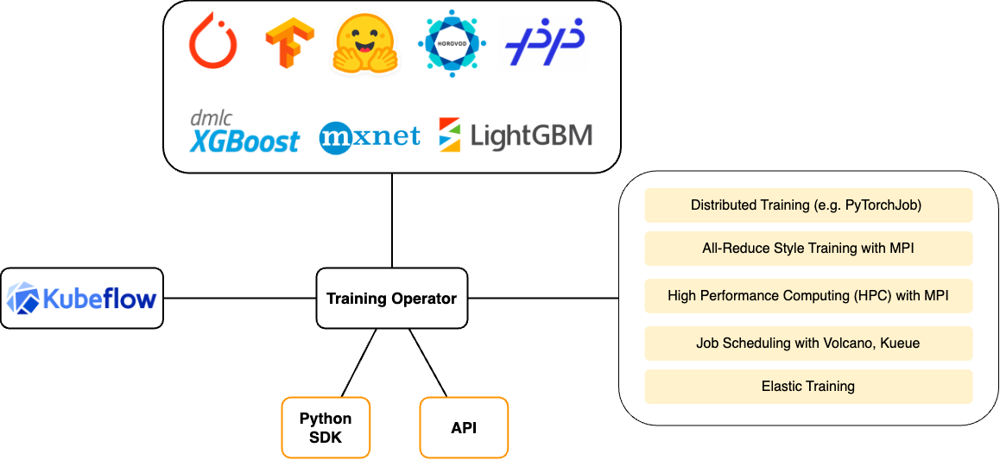

+++
title = "Overview"
description = "An overview of Kubeflow Training Operator"
weight = 5
+++

Kubeflow Training Operator is a Kubernetes-native project for fine-tuning and scalable
distributed training of machine learning (ML) models created with various ML frameworks such as
PyTorch, Tensorflow, XGBoost, and others.

Training Operator allows you to use Kubernetes workloads to effectively train your large models
via Kubernetes Custom Resources APIs or using Training Operator Python SDK.

Training Operator implements centralized Kubernetes controller to orchestrate distributed training jobs.

## Architecture

This diagram shows the major features of Training Operator and supported ML frameworks.



## Custom Resources for ML Frameworks

To perform distributed training Training Operator implements the following
[Custom Resources](https://kubernetes.io/docs/concepts/extend-kubernetes/api-extension/custom-resources/):

| ML Framework | Custom Resource |
| ------------ | --------------- |
| PyTorch      | PyTorchJob      |
| Tensorflow   | TFJob           |
| Apache MXNet | MXJob           |
| XGBoost      | XGBoostJob      |
| MPI          | MPIJob          |
| PaddlePaddle | PaddleJob       |

You can learn more about each framework in the appropriate guide.

## Getting Started

You can create your first Training Operator job using Python SDK. Define the training function
that implements end-to-end model training. Training Operator schedules appropriate resources
to run this training function on every Worker.

Install Training Operator SDK:

```
pip install kubeflow-training
```

You can implement your training loop in the train function. Each Worker will execute this function
on the appropriate Kubernetes Pod. Usually, this function contains logic to download dataset,
create model, and train the model.

World Size and Rank will be set automatically by Training Operator controller to perform
[PyTorch DDP](https://pytorch.org/tutorials/intermediate/ddp_tutorial.html).

For example:

```python
def train_func():
    import torch
    import os

    # Create model.
    class Net(torch.nn.Module):
        """Create the Pytorch model"""
        ...
    model = Net()

    # Download dataset.
    train_loader = torch.utils.data.DataLoader(...)

    # Attach model to PyTorch distributor.
    RANK = int(os.environ["RANK"])
    WORLD_SIZE = int(os.environ["WORLD_SIZE"])
    torch.distributed.init_process_group(backend="nccl", rank=RANK, world_size=WORLD_SIZE)
    Distributor = torch.nn.parallel.DistributedDataParallel
    model = Distributor(model)

    # Start model training.
    model.train()

# Start PyTorchJob with 100 Workers and 2 GPUs per Worker.
from kubeflow.training import TrainingClient
TrainingClient().create_job(
    name="pytorch-ddp",
    func=train_func,
    num_workers=100,
    resources_per_worker={"gpu": "2"},
)
```

## Next steps

- Learn more about [the PyTorchJob APIs](/docs/components/training/pytorch/).

- Follow [the scheduling guide](/docs/components/training/job-scheduling.md) to configure various
  job schedulers for Training Operator jobs.
